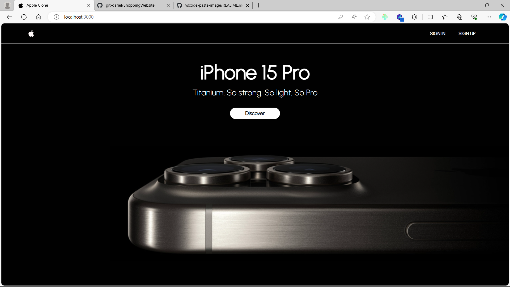

# Getting Started with Apple Inspired E-Commerce Web Application

This project was created by Dariel Avila.

## Description of the system

This project, "Apple-Inspired E-Commerce," aims to deliver a seamless and stylish shopping experience, drawing inspiration from Apple Inc.'s design philosophy. Using technologies like ReactJS, Node.js, and MySQL, we strive to create an innovative e-commerce platform featuring products similar to Apple's flagship line, including the iPhone15. Key features include user authentication, easy product listing, and a flawless add-to-cart functionality. Our goal is to surpass the transactional aspect of e-commerce and provide consumers with a virtual shopping adventure that reflects the innovation found in Apple Inc.'s products.

